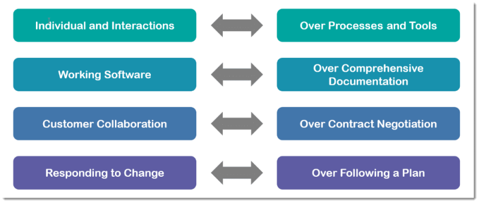
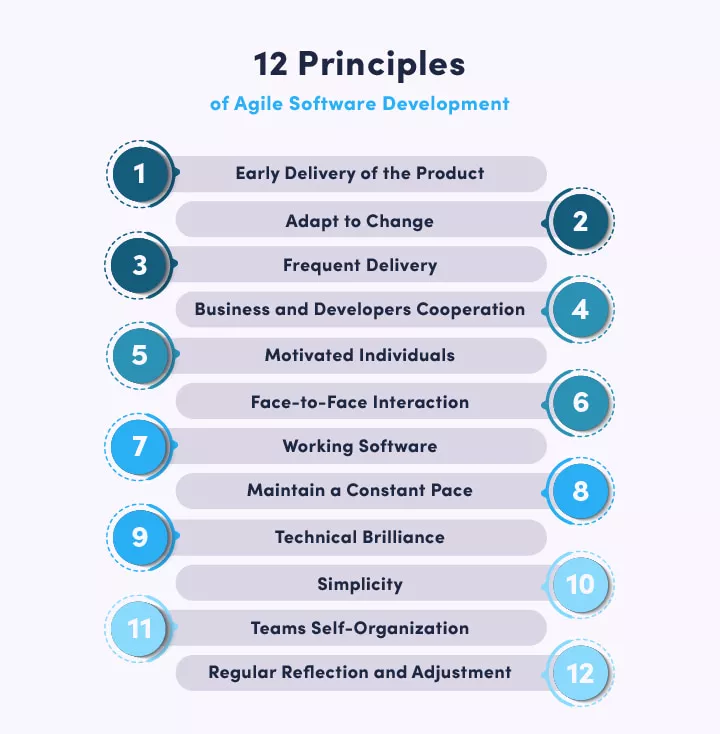
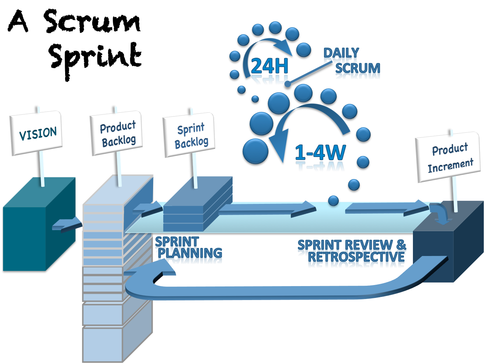

## Brief

### Preparation

N/A

### Lesson Overview

We will spend the first hour learning about Agile and SCRUM yet keeping in mind with other Agile methodology. We will then learn about the difference between using Object Literal (previous lesson) and Class (today's).

---

### Self studies check-in

Q1: Describe the Waterfall Model.

Q2: Describe the Agile Model.

Q3: Describe the difference between Waterfall and Agile model.

---

## Part 1 - All Agile Methodologies

The most popular Agile Methodology is SCRUM, but it is not the only methodology.

### The Agile Manifesto

1. Processes and Tools are not as agile as human beings.
1. Intuitive software is better than excessive documentation.
1. Collaboration ensures product development is aligned with end users' requirement.
1. When business change, the tech team must adapt.

---

### 12 Principles of Agile

The 12 principles applies to every agile methodologies.

### Activity - Research

Choose 3 among the following Agile Methodologies and research how each is conducted:
- Extreme Programming (XP)
- Scrum
- Crystal
- Dynamic Systems Development Method (DSDM)
- Lean Development
- Feature-Driven Development (FDD)
- Test Driven Development (TDD)
- Kanban

---

## Part 2 - SCRUM

SCRUM is one of the many Agile Methodologies.

SCRUM Theory:
Empricism through:
1. Transparency - Giving visibility to processes 
1. Inspection - Timely checks of progress
1. Adaptation - Adjusting the process as needed

Scrum Values:
1. Courage - We admit we do not know everything 
1. Focus - focus on what is important
1. Commitment - dedicated to delivering quality software
1. Respect - create cross-functional, self-organizing teams
1. Openness - frequently inspecting through delivery

A Scrum team is composed of:
1. Product Owner - Manages the Product Backlog and optimizes the value of the Product
1. Scrum Master - Manages the Scrum process and removes impediments
1. Development Team - Manages itself and create increments based on Definition of Done

In SCRUM, there are four meetings:

1. *Sprint Planning* - Laying out the work to be performed for the sprint. (4 to 8 hours)
1. *Daily Scrum* - Inspect progress toward the Sprint Goal. (15 mins)
1. *Sprint Review* - Inspect the outcome of the Sprint. (1 to 4 hours)
1. *Sprint Retrospective* - Plan ways to increase quality and effectiveness. (1 to 3 hours)

Source: https://www.scrum.org/resources/what-is-scrum

### Activity - Research
What are the use of each Scrum artifacts:
1. Product Backlog
1. Sprint Backlog
1. Product Increment

---

## Part 3 - Class Activity (What are agile user stories?)

|Action|Duration|Outcome|
|----|--------|-------|
|Learners self Reading for this [link](https://www.atlassian.com/agile/project-management/user-stories).|10 mins|Learners have a brief understanding of what agile user stories are.
|Instructor facilitate students to answer three questions by getting students to type in chat.|20 mins|Summarizes and highlight the good inputs from student.|

Three Questions:
1. What are user stories?
1. Why user stories?
1. Think and provide an example of a user story.

